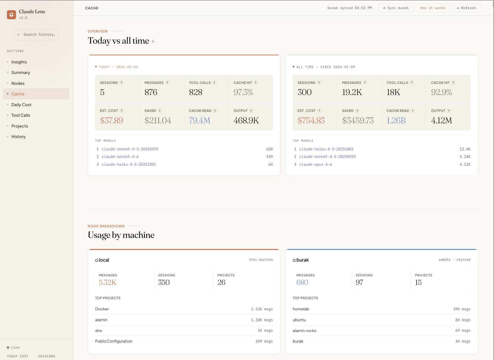

# claude-lens

A local dashboard for visualizing your [Claude Code](https://claude.ai/code) usage — sessions, token costs, cache performance, tool calls, and daily breakdowns.



## Features

- **Today vs All-Time stats** — sessions, messages, tool calls, estimated cost
- **Cache performance** — hit rate, savings vs no-cache baseline
- **Daily cost & cache table** — per-day token breakdown with estimated spend
- **Tool call analytics** — which tools Claude used most, across all projects
- **Multi-node support** — sync a remote machine's `~/.claude` via rsync and compare usage side-by-side
- **Per-model pricing** — separate rates for Haiku, Sonnet, and Opus via `.env`

## Requirements

- Node.js 18+
- Claude Code installed (data lives in `~/.claude`)

## Quick start

No install needed — run directly from GitHub:

```bash
npx github:alamin-mahamud/claude-lens
```

Then open [http://localhost:3456](http://localhost:3456). Defaults to `~/.claude` if `CLAUDE_DIR` is not set.

## Local setup

```bash
git clone https://github.com/alamin-mahamud/claude-lens.git
cd claude-lens
npm install
cp .env.example .env
```

Edit `.env` and set `CLAUDE_DIR` to your Claude data directory (defaults to `~/.claude`).

```bash
node server.js
```

Open [http://localhost:3456](http://localhost:3456).

## Configuration

All options are set via `.env`:

| Variable                  | Default  | Description                              |
|---------------------------|----------|------------------------------------------|
| `CLAUDE_DIR`              | `~/.claude` | Path to local Claude data directory   |
| `REMOTE_HOST`             | _(unset)_ | SSH host to sync remote Claude data from |
| `REMOTE_CLAUDE_DIR`       | `~/.claude` | Path on the remote host               |
| `RATE_HAIKU_INPUT`        | `1.0`    | Haiku input price (USD per 1M tokens)    |
| `RATE_HAIKU_OUTPUT`       | `5.0`    | Haiku output price (USD per 1M tokens)   |
| `RATE_HAIKU_CACHE_WRITE`  | `1.25`   | Haiku cache write price (USD per 1M)     |
| `RATE_HAIKU_CACHE_READ`   | `0.10`   | Haiku cache read price (USD per 1M)      |
| `RATE_SONNET_INPUT`       | `3.0`    | Sonnet input price (USD per 1M tokens)   |
| `RATE_SONNET_OUTPUT`      | `15.0`   | Sonnet output price (USD per 1M tokens)  |
| `RATE_SONNET_CACHE_WRITE` | `3.75`   | Sonnet cache write price (USD per 1M)    |
| `RATE_SONNET_CACHE_READ`  | `0.30`   | Sonnet cache read price (USD per 1M)     |
| `RATE_OPUS_INPUT`         | `5.0`    | Opus input price (USD per 1M tokens)     |
| `RATE_OPUS_OUTPUT`        | `25.0`   | Opus output price (USD per 1M tokens)    |
| `RATE_OPUS_CACHE_WRITE`   | `6.25`   | Opus cache write price (USD per 1M)      |
| `RATE_OPUS_CACHE_READ`    | `0.50`   | Opus cache read price (USD per 1M)       |

Default rates match the **Anthropic API** (claude.ai/code). Adjust for Bedrock or other providers as needed.

## Multi-node sync

To include usage from a remote machine, set `REMOTE_HOST` in `.env`:

```env
REMOTE_HOST=my-jump-host
REMOTE_CLAUDE_DIR=~/.claude
```

Then click **⇄ Sync** in the dashboard. Data is pulled via `rsync` over SSH and merged with local data. Use the node filter pills to view usage per host or combined.
